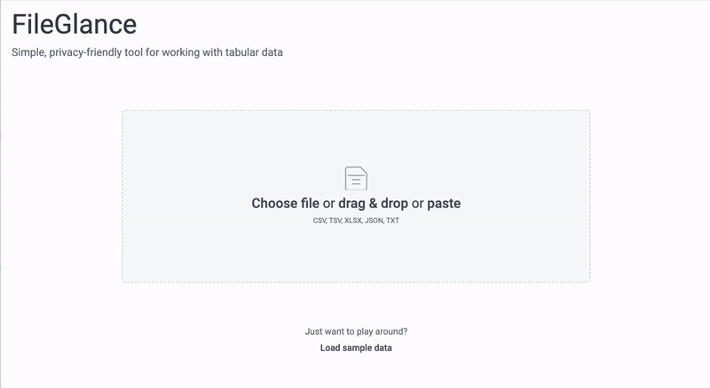

# [FileGlance](https://www.fileglance.info/)

<p align="center">

_A powerful tool for viewing, filtering, and transforming tabular data files (CSV, JSON, XLSX, and more)._



</p>

Try the live version at [FileGlance.info](https://www.fileglance.info/)

## Why FileGlance?

**Frustrated by:**

1. Needing different tools for different formats.
2. Lack of tools optimized for quickly understanding data.
3. Messy files that require cleaning before use.

I built FileGlance as a side project and a fun way to learn React and Tailwind.

Maybe it will help others, too.

It aims to be both:

- **Simple:** Just drag and drop a file; it automatically detects encoding, delimiter, headers, and more.
- **Powerful:** Run custom JavaScript to filter and transform data at scale.

## Features

- Drag-and-drop support for all common file types (CSV, XLSX, JSON, etc.)
- Automatic detection of file encoding, delimiters, and data location
- Optimized display (hides empty columns by default)
- Simple filtering with value facets for exact matches
- Full-text search across data
- Basic sorting functionality
- Advanced row filtering using custom JavaScript
- Advanced value transformation using custom JavaScript
- One-click export to CSV, XLSX, or JSON
- Handles large files with virtualized list rendering
- Visual representation of value counts (histograms for numeric data)
- Progressive Web App (PWA) support
- Privacy-focused: Your data never leaves your device

## Use Cases

#### Data Viewing & Exploration

View raw data and column types. Get visualizations for categorical and continuous data (histograms). For numeric values, see statistics like average, median, min, and max.  
Use it as:

- Online CSV / TSV / Excel viewer
- See column stats like average, median, min, and max for numeric columns (e.g., "Find the average order value in a sales CSV")
- Data type inspector (e.g., "Quickly validate which columns are text, numbers, or dates")
- File converter (e.g., "Convert an Excel file to CSV or JSON in one click")

#### Data Filtering & Cleaning

Apply quick filters with one click or use complex filter functions with custom JavaScript. For example:

- Remove empty rows or columns
- Trim whitespace from values
- Deduplicate based on specific columns
- Find unique values
- Replace missing values with defaults
- Detect and handle outliers

#### Data Transformation

Transform data using custom JavaScript functions. For example:

- Parse numbers from text
- Normalize text case (e.g., all lowercase)
- Split the domain from an email
- Format Unix timestamps to readable dates
- Merge similar categories (e.g., "NY" and "New York")
- Export to CSV, JSON, Markdown etc.

## Integration

Other applications and tools can seamlessly integrate with FileGlance by deep linking complete data sets (CSV or JSON) using the URL hash parameter like so:

```
https://www.fileglance.info/#d=ID,Name,Age%0A1,Alice,30%0A2,Bob,25
```

This ensures that all data remains on the client and is never transmitted to the server.

Privacy notice: Please be aware that data embedded in the URL is currently not encrypted. If you share the URL (e.g., via email), your data may leave your device and become accessible to others.

### Example: Uncompressed

Using `d` param: Accepting either CSV or JSON string. Base64 encoded would also work.

**Browser**

```js
// Using CSV
const csv = "ID,Name,Age\n1,Alice,30\n2,Bob,25"
const url = "https://www.fileglance.info/#d=" + encodeURI(csv)

// Using JSON
const json = JSON.stringify([
  { id: 1, name: "Alice", age: 30 },
  { id: 2, name: "Bob", age: 25 },
])
const url = "https://www.fileglance.info/#d=" + encodeURI(json)

window.open(url, "_blank")
```

**Python**

```python
import webbrowser
import urllib.parse

csv = "ID,Name,Age\n1,Alice,30\n2,Bob,25"
url = "https://www.fileglance.info/#d=" + urllib.parse.quote(csv, safe='/;,?&#')
webbrowser.open_new_tab(url)
```

### Example: ZIP compressed

Using `c` param: Accepting Base64 encoded zipped data.

**Browser**

```js
const csv = "ID,Name,Age\n1,Alice,30\n2,Bob,25"

const byteArray = new TextEncoder().encode(csv)
const cs = new CompressionStream("gzip")
const writer = cs.writable.getWriter()
writer.write(byteArray) && writer.close()
const gzipped = await new Response(cs.readable).arrayBuffer()

const base64Gzipped = btoa(String.fromCharCode(...new Uint8Array(gzipped)))
const url = "https://www.fileglance.info/#c=" + base64Gzipped
console.log(url)
window.open(url, "_blank")
```

**Node**

```js
import zlib from "zlib"
// import open from "open" // npm install open

const csv = "ID,Name,Age\n1,Alice,30\n2,Bob,25"

const base64Gzipped = zlib.gzipSync(csv).toString("base64")

const url = "https://www.fileglance.info/#c=" + base64Gzipped
console.log(url)
// Optional: open in default browser
// await open(url)
```

## Roadmap

- Support for additional file formats
- Code history
- View & edit transformer
- Encrypt URL and exported data
- Advanced data manipulation, including column renaming, splitting and merging
- Options to override detected encoding and delimiters
- More export settings

## Out of Scope

- Spreadsheet-like editing single cells
- Server-side processing
- Mobile and touch optimizations
- Support for legacy browsers
- Handling very large files (e.g., files larger than several GBs may be better managed outside the browser)

## Development

```bash
npm install
npm run dev
```

### Tech Stack

- TypeScript
- Next.js / React
- Tailwind CSS
